# CRM-123 · Manual de usuario

Gestión comercial de calzado y moda

---

## Cómo usar este manual

Está dividido en cuatro partes. **Lee solo la tuya.**

| Si eres… | Lee |
|---|---|
| Vendedor | Partes 1 y 2 |
| Supervisor, en el ordenador | Partes 1, 2 y 3 |
| Supervisor, en el móvil | Parte 4 |

Al final hay tres anexos que sirven a todos: los **mensajes** que puede
enseñarte el sistema, las **dudas frecuentes** y un **glosario**.

Las imágenes son de un entorno de pruebas: los nombres, importes y fechas que
verás en ellas son inventados.

---

## Quiero hacer…

Lo que más se busca, directo:

| | |
|---|---|
| Entrar por primera vez | [§1.2](#12-tu-primera-vez-cambiar-la-contraseña) |
| No me deja entrar | [§1.1](#si-no-te-deja-entrar) |
| Registrar un cliente nuevo | [§2.5](#registrar-un-cliente-nuevo) |
| Apuntar una llamada o una visita | [§2.5](#registrar-lo-que-ha-pasado) |
| Abrir una oportunidad | [§2.5](#abrir-una-oportunidad) |
| Cerrar una venta ganada | [§2.5](#cerrar-una-venta-ganada) |
| Cerrar una oportunidad perdida | [§2.5](#cerrar-una-oportunidad-perdida) |
| Quitar algo de «atrasadas» | [§2.1](#21-el-tablero-del-día) |
| Retirar un cliente que ya no procede | [§2.5](#archivar-un-cliente) |
| Dar de alta a alguien del equipo | [§3.2](#crear-un-usuario) |
| Dar de baja a alguien que se va | [§3.2](#desactivar-y-reactivar) |
| Recuperar la contraseña de un vendedor | [§3.2](#restablecer-una-contraseña) |
| Fijar o cambiar las metas del mes | [§3.3](#33-administración--cuotas) |
| Pasar un cliente a otro vendedor | [§3.5](#35-reasignar-un-cliente) |
| Ver quién hizo qué | [§3.4](#34-administración--auditoría) |
| Enviar el resumen fuera de hora | [§4.4](#44-enviar-el-resumen-matutino-a-mano) |
| Un vendedor dice que no le llega el correo | [§5](#si-un-vendedor-dice-que-no-le-llega) |
| No entiendo un mensaje que me ha salido | [Anexo A](#anexo-a--mensajes-del-sistema) |
| Tengo una duda suelta | [Anexo B](#anexo-b--dudas-frecuentes) |
| ¿Qué significa esta palabra? | [Anexo C](#anexo-c--glosario) |

---

## Contenido

**[Parte 1 · Para todos](#parte-1--para-todos)**

- [1.1 Entrar](#11-entrar) · [Si no te deja entrar](#si-no-te-deja-entrar)
- [1.2 Tu primera vez: cambiar la contraseña](#12-tu-primera-vez-cambiar-la-contraseña)
- [1.3 Salir](#13-salir)

**[Parte 2 · Manual del vendedor](#parte-2--manual-del-vendedor)**

- [2.1 El tablero del día](#21-el-tablero-del-día)
- [2.2 Oportunidades](#22-oportunidades)
- [2.3 Clientes](#23-clientes)
- [2.4 La ficha de cliente](#24-la-ficha-de-cliente)
- [2.5 Los seis procedimientos](#25-los-seis-procedimientos)
  - [Registrar un cliente nuevo](#registrar-un-cliente-nuevo)
  - [Abrir una oportunidad](#abrir-una-oportunidad)
  - [Registrar lo que ha pasado](#registrar-lo-que-ha-pasado)
  - [Mover la etapa](#mover-la-etapa)
  - [Cerrar una venta ganada](#cerrar-una-venta-ganada)
  - [Cerrar una oportunidad perdida](#cerrar-una-oportunidad-perdida)
  - [Archivar un cliente](#archivar-un-cliente)
- [2.6 Cosas que el sistema no te va a dejar hacer](#26-cosas-que-el-sistema-no-te-va-a-dejar-hacer)

**[Parte 3 · Manual del supervisor · Ordenador](#parte-3--manual-del-supervisor--ordenador)**

- [3.1 Equipo](#31-equipo)
- [3.2 Administración › Usuarios](#32-administración--usuarios)
  - [Crear un usuario](#crear-un-usuario)
  - [La contraseña inicial](#la-contraseña-inicial)
  - [Desactivar y reactivar](#desactivar-y-reactivar)
  - [Restablecer una contraseña](#restablecer-una-contraseña)
- [3.3 Administración › Cuotas](#33-administración--cuotas)
- [3.4 Administración › Auditoría](#34-administración--auditoría)
- [3.5 Reasignar un cliente](#35-reasignar-un-cliente)

**[Parte 4 · Manual del supervisor · Móvil](#parte-4--manual-del-supervisor--móvil)**

- [4.1 Instalarla y entrar](#41-instalarla-y-entrar)
- [4.2 El panel](#42-el-panel)
- [4.3 Ver a un vendedor](#43-ver-a-un-vendedor)
- [4.4 Enviar el resumen matutino a mano](#44-enviar-el-resumen-matutino-a-mano)
  - [Paso 1 · Confirmar](#paso-1--confirmar) · [Paso 2 · Esperar](#paso-2--esperar) · [Paso 3 · Resultado](#paso-3--resultado)
  - [Si lo pulsas otra vez enseguida](#si-lo-pulsas-otra-vez-enseguida)

**[Parte 5 · El resumen matutino](#parte-5--el-resumen-matutino)**

- [Qué es](#qué-es) · [Qué trae](#qué-trae) · [Si un vendedor dice que no le llega](#si-un-vendedor-dice-que-no-le-llega)

**Anexos**

- [A · Mensajes del sistema](#anexo-a--mensajes-del-sistema)
- [B · Dudas frecuentes](#anexo-b--dudas-frecuentes)
- [C · Glosario](#anexo-c--glosario)

---
---

# Parte 1 · Para todos

## 1.1 Entrar

Se entra con **nombre de usuario**, no con tu correo. Te lo da tu supervisor
junto con una contraseña, en persona.

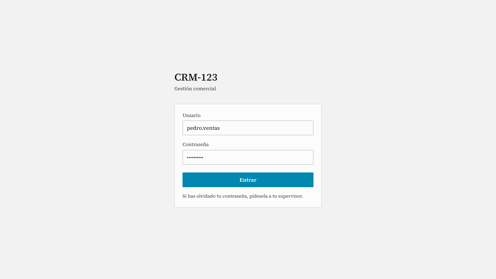

1. Escribe tu **usuario** (por ejemplo, `pedro.ventas`).
2. Escribe tu **contraseña**.
3. Pulsa **Entrar**.

### Si no te deja entrar

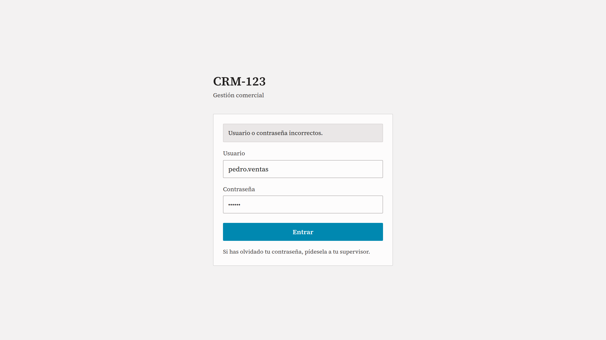

El mensaje *«Usuario o contraseña incorrectos.»* aparece siempre igual, tanto
si te has equivocado de usuario como de contraseña. Es a propósito: así nadie
puede averiguar qué usuarios existen probando nombres.

Comprueba que no tienes activadas las mayúsculas y que el usuario está bien
escrito. Si sigue sin funcionar, **pídele a tu supervisor que te restablezca la
contraseña**. No hay ningún «he olvidado mi contraseña» por correo, y no lo
habrá: las contraseñas se entregan en mano.

Si te has equivocado varias veces seguidas verás *«Demasiados intentos. Espera
unos minutos.»* No está roto: espera un momento y vuelve a probar.

## 1.2 Tu primera vez: cambiar la contraseña

La primera vez que entres, el sistema **te obliga** a cambiar la contraseña
antes de dejarte hacer nada. Pasa lo mismo cada vez que tu supervisor te la
restablezca.

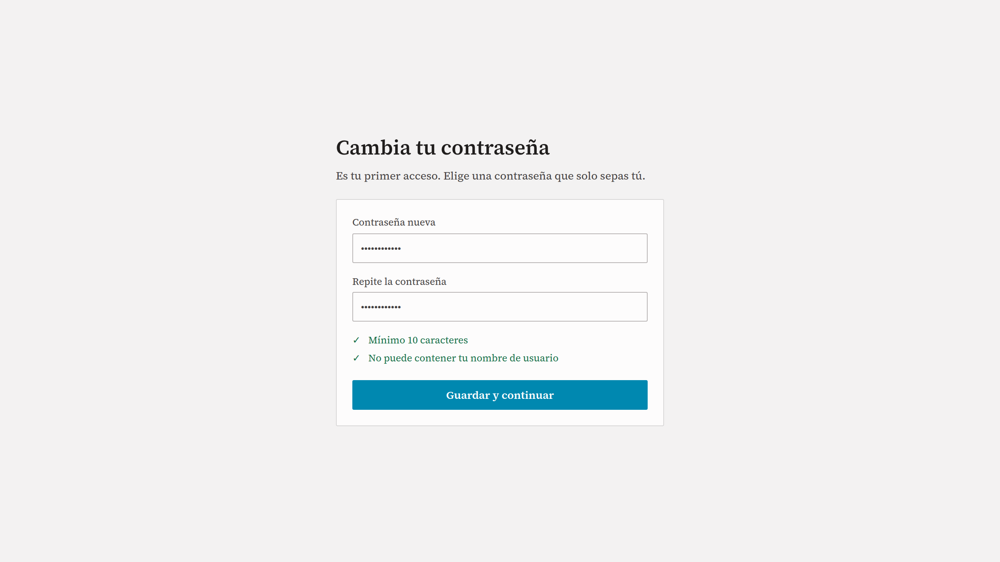

Tu contraseña nueva tiene que cumplir dos cosas, y las verás marcarse solas
mientras escribes:

- **Mínimo 10 caracteres.**
- **No puede contener tu nombre de usuario.**

Elige algo que recuerdes. Si la pierdes, el único camino es pedirle a tu
supervisor que te la restablezca.

## 1.3 Salir

El botón **Cerrar sesión** está al final de la barra lateral, debajo de tu
nombre. En el móvil, al final del panel.

Ciérrala siempre si compartes el ordenador.

[↑ Volver al contenido](#contenido)

---
---

# Parte 2 · Manual del vendedor

Tu día tiene tres pantallas, y están en la barra de la izquierda: **Tablero del
día**, **Oportunidades** y **Clientes**.

## 2.1 El tablero del día

Es donde empiezas. Responde a una sola pregunta: **¿qué tengo que hacer hoy?**

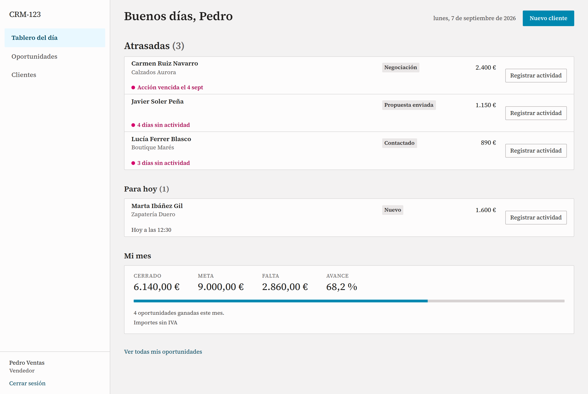

De arriba abajo:

**Atrasadas.** Lo que reclama tu atención. Cada línea te dice el cliente, la
etapa, el importe y —lo importante— **por qué está atrasada**: si venció la
acción que agendaste o cuántos días lleva sin que pase nada.

**Para hoy.** Lo que tú mismo agendaste para hoy, con su hora.

**Mi mes.** Cuánto llevas cerrado, tu meta, cuánto te falta y el porcentaje.

Cuando no tienes nada pendiente, el tablero te lo dice y no te ofrece nada más:

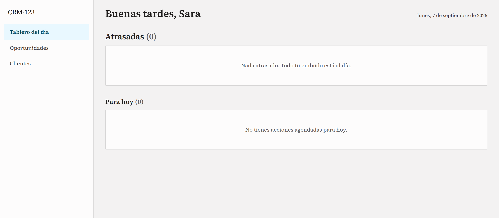

> **¿Cuándo se considera atrasada una oportunidad?**
>
> Cuando pasa **cualquiera** de estas dos cosas:
>
> - Venció la próxima acción que habías agendado.
> - Lleva demasiados días sin actividad, según en qué etapa esté:
>
>   | Etapa | Días |
>   |---|---|
>   | Nuevo | 3 |
>   | Contactado | 3 |
>   | Propuesta enviada | 2 |
>   | Negociación | 2 |
>
> **La forma de quitarla de ahí es registrar una actividad** (§2.5). El sistema
> solo sabe lo que le cuentas: si hablaste con el cliente y no lo registraste,
> para el CRM no ha pasado nada.

## 2.2 Oportunidades

La lista completa de todo lo que tienes abierto, para cuando quieras la foto
entera y no solo lo urgente.

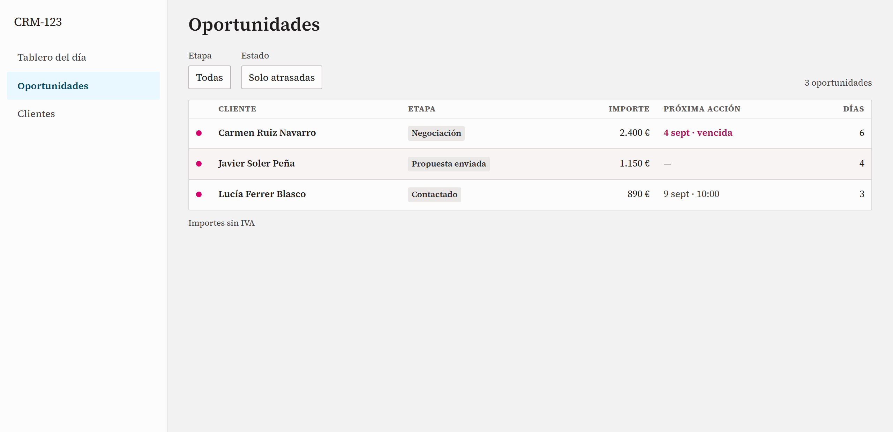

Puedes filtrar por **etapa** y por **solo atrasadas**. El punto de color de la
izquierda marca las atrasadas, y a la derecha tienes los días que llevan
paradas.

Pulsa cualquier fila para ir a la ficha de ese cliente.

## 2.3 Clientes

Tus clientes, con un buscador que entiende nombre, empresa y teléfono.

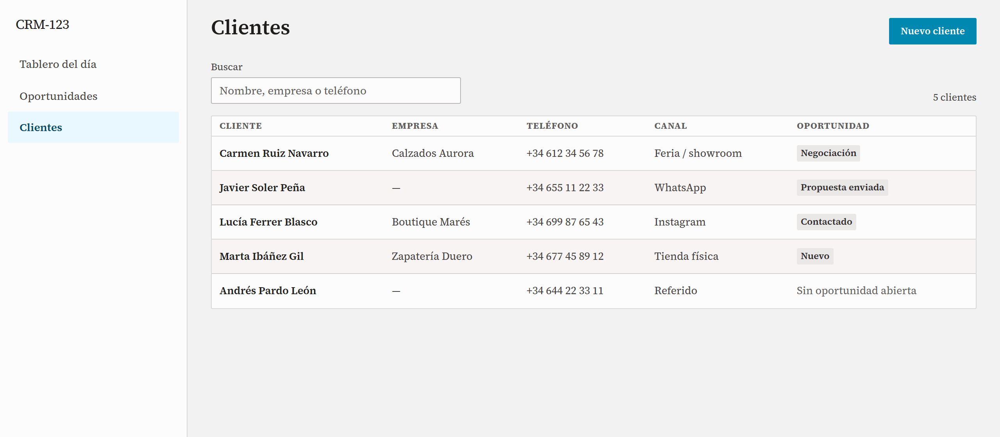

**Solo ves los tuyos.** No es que estén escondidos: el sistema no te entrega
los de tus compañeros.

## 2.4 La ficha de cliente

Aquí es donde se trabaja. Todo lo que sabes de esa persona, en una pantalla.

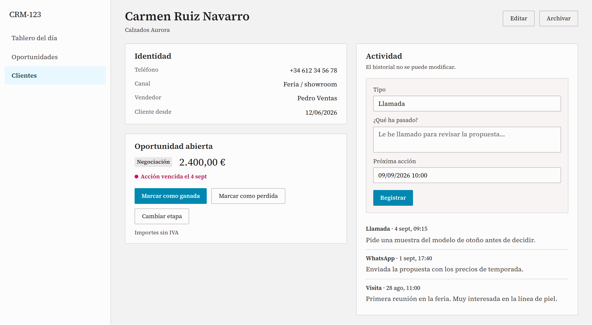

A la izquierda, **quién es** y **la oportunidad abierta**, con los botones para
moverla. A la derecha, **la actividad**: el formulario para registrar lo que
acaba de pasar y, debajo, todo el historial.

## 2.5 Los seis procedimientos

### Registrar un cliente nuevo

1. Pulsa **Nuevo cliente**, arriba a la derecha.
2. Rellena **Nombre** y **Teléfono**. Son los dos obligatorios.
3. **Empresa** y **Canal** si los sabes. El canal es por dónde te llegó:
   tienda física, WhatsApp, Instagram, feria, referido, llamada u otro.
4. Pulsa **Crear cliente**.

Mientras escribes el teléfono verás *«Comprobando…»*. El sistema mira que no
exista ya en la empresa: **un teléfono no puede estar en dos clientes**.

Puedes escribirlo como quieras —con espacios, con `+34` o sin él—: el sistema
lo ordena. Tiene que ser un móvil o fijo español de nueve dígitos.

> **Si el teléfono ya existe**, el sistema te avisa pero **no te dice de quién
> es ni te enseña ningún dato**. Puede ser un cliente de un compañero. Habla
> con tu supervisor: él sí puede verlo y, si procede, pasártelo.

### Abrir una oportunidad

Desde la ficha del cliente, botón **Nueva oportunidad**.

1. Pon el **importe estimado**.
2. Pon la **próxima acción**: cuándo vas a volver a hablar con esa persona.
3. Pulsa **Crear oportunidad**.

Nace en la etapa **Nuevo**.

> **Un cliente solo puede tener una oportunidad abierta a la vez.** Si quieres
> abrir otra, primero cierra la que tienes.

### Registrar lo que ha pasado

**Es lo más importante que harás en el sistema.** Es lo que mantiene todo al
día y lo que quita las cosas del bloque de atrasadas.

1. En la ficha del cliente, ve al recuadro de la derecha.
2. Elige el **Tipo**: llamada, WhatsApp, email, visita o nota.
3. Escribe en **¿Qué ha pasado?** lo que quieras recordar dentro de un mes.
4. Si toca, pon una nueva **Próxima acción**.
5. Pulsa **Registrar**.

> **El historial no se puede modificar ni borrar.** Si te equivocaste, escribe
> otra nota aclarándolo. Es a propósito: un historial que se puede reescribir
> no sirve para nada.

### Mover la etapa

Desde la oportunidad, botón **Cambiar etapa**. Las cinco etapas, en orden:

`Nuevo` → `Contactado` → `Propuesta enviada` → `Negociación` → `Cerrado`

### Cerrar una venta ganada

1. Botón **Marcar como ganada**.
2. Escribe el **importe final** —el de verdad, no el estimado—.
3. Confirma.

> **No se puede reabrir.** Si te equivocas de importe o de cliente, la única
> salida es abrir una oportunidad nueva y explicarlo en una nota. Léelo dos
> veces antes de confirmar.

### Cerrar una oportunidad perdida

1. Botón **Marcar como perdida**.
2. Elige el **motivo**: precio, no responde, compró a la competencia, sin
   presupuesto, no era el momento, cancelación u otro.
3. Confirma.

El motivo no es burocracia: tu supervisor ve el resumen de motivos del mes y es
lo que permite detectar si estáis perdiendo por precio o por lentitud.

### Archivar un cliente

Cuando un cliente ya no procede, botón **Archivar**. Deja de aparecer en tu
lista.

**No se borra nada.** Si vuelve, lo desarchivas y sigue todo su historial ahí.

## 2.6 Cosas que el sistema no te va a dejar hacer

Para que no las busques:

- **Borrar** un cliente, una oportunidad o una actividad. Se archiva, se cierra
  y se añade, respectivamente.
- **Reabrir** una oportunidad cerrada.
- **Editar** el historial de actividad.
- **Pasar un cliente a otro vendedor.** Eso lo hace el supervisor.
- **Ver nada de otro vendedor.**

[↑ Volver al contenido](#contenido)

---
---

# Parte 3 · Manual del supervisor · Ordenador

Tienes todo lo del vendedor, más dos entradas en la barra lateral: **Equipo** y
**Administración**.

## 3.1 Equipo

Responde a **¿cómo va el equipo?**

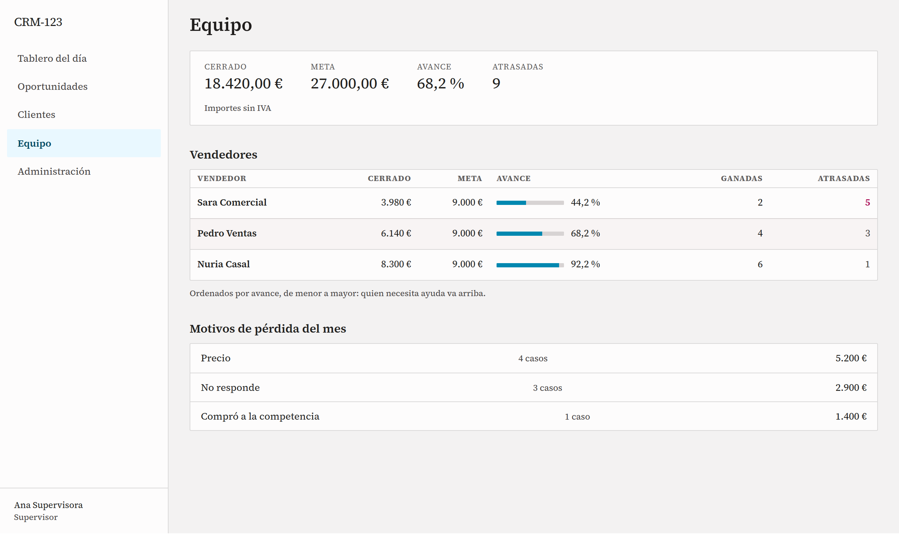

Arriba, las cuatro cifras del mes. En medio, la tabla de vendedores. Abajo, por
qué se está perdiendo.

> **La tabla está ordenada de menor a mayor avance**, no alfabéticamente ni por
> quien más vende. Quien necesita ayuda sale arriba. Es deliberado: esta
> pantalla existe para decidir a quién echar una mano hoy.

La columna **Atrasadas** se marca en color cuando son cinco o más. Pulsa un
nombre para ver sus oportunidades.

Los vendedores desactivados no aparecen ni suman en los totales.

## 3.2 Administración › Usuarios

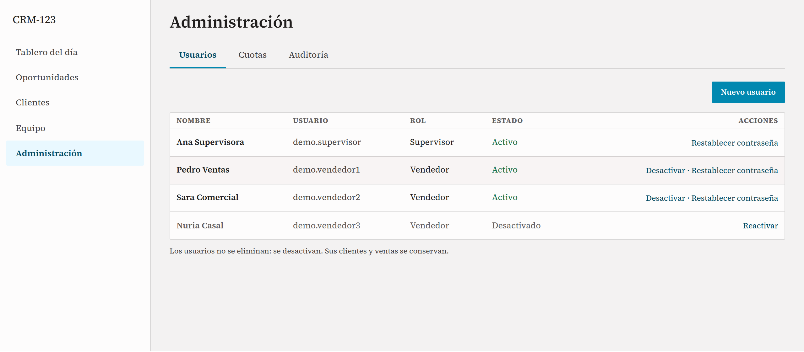

### Crear un usuario

1. Pulsa **Nuevo usuario**.
2. **Nombre completo**, tal como quieras que salga en las pantallas.
3. **Nombre de usuario**: minúsculas, números, punto, guion y guion bajo. Entre
   3 y 32 caracteres. Es con lo que esa persona entrará.
4. **Email**: aquí le llegará el resumen matutino. Que esté bien escrito.
5. **Rol**: vendedor o supervisor.
6. Si es vendedor, puedes fijarle ya la **meta de este mes**.
7. Pulsa **Crear usuario**.

### La contraseña inicial

> ## ⚠ Léelo antes de pulsar
>
> **La contraseña se enseña UNA SOLA VEZ.** En cuanto cierres esa ventana o
> recargues la página, desaparece para siempre.
>
> **Cópiala antes de cerrar** y entrégasela a la persona **en mano**. No por
> WhatsApp, no por correo.
>
> Si la pierdes no pasa nada grave: usa **Restablecer contraseña** y se genera
> otra. Pero tendrás que volver a localizar a esa persona.

Quien la reciba tendrá que cambiarla la primera vez que entre.

### Desactivar y reactivar

**Desactivar** deja a esa persona sin poder entrar. Sus clientes, sus ventas y
su historial **se conservan intactos**, y sus cifras dejan de contar en el panel
del equipo.

Es lo que se hace cuando alguien deja la empresa. **No existe «eliminar
usuario»**, y no lo busques: borrarlo se llevaría por delante el historial
comercial de sus clientes.

**No puedes desactivar tu propia cuenta.** El sistema te lo impide, para que
nadie se deje a la empresa sin supervisores.

### Restablecer una contraseña

Genera una nueva, se enseña una sola vez —con el mismo aviso de arriba— y la
persona tendrá que cambiarla al entrar.

## 3.3 Administración › Cuotas

Aquí fijas las metas del mes. Sin meta, el vendedor ve `—` en su avance, nunca
`0 %`.

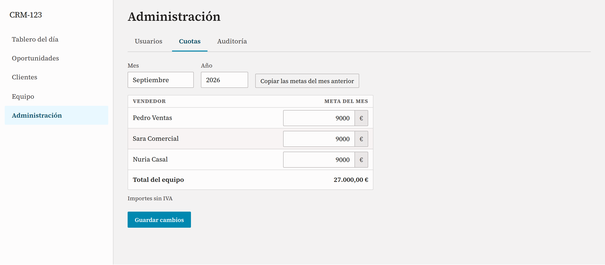

1. Elige **mes** y **año**. Al cambiarlos se cargan las metas de ese periodo.
2. Escribe la meta de cada vendedor, en euros y **sin IVA**.
3. Pulsa **Guardar cambios**.

El **total del equipo** se calcula solo al pie.

**Copiar las metas del mes anterior** rellena los campos con las del mes
pasado, pero **no guarda nada**: las revisas, las ajustas y pulsas guardar. Si
cierras sin guardar, no ha pasado nada.

Cambiar una meta recalcula el avance de esa persona al momento.

## 3.4 Administración › Auditoría

Quién hizo qué y cuándo.

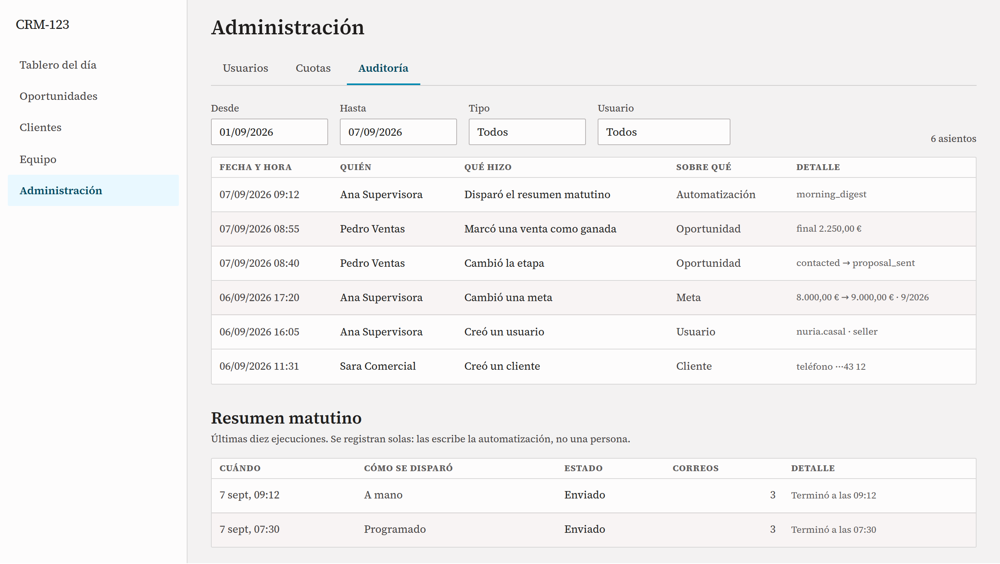

Puedes filtrar por **fechas**, por **tipo** —cliente, oportunidad, usuario,
meta, automatización— y por **usuario**.

Se registran catorce acciones: crear, editar, archivar y reasignar clientes;
crear oportunidades, cambiar etapa, ganarlas y perderlas; crear, desactivar y
reactivar usuarios; cambiar contraseñas; cambiar metas; y disparar el resumen a
mano.

> **Este registro no se puede editar ni borrar, ni siquiera por ti.** Es lo que
> le da valor. Tampoco hay botón de exportar.

Debajo tienes las **últimas ejecuciones del resumen matutino**: cuándo salió,
si fue automático o a mano, si funcionó y cuántos correos se enviaron. Es lo
primero que debes mirar si un vendedor te dice que no le llega el correo.

## 3.5 Reasignar un cliente

Es tuyo en exclusiva. Entra en la ficha del cliente y usa **Reasignar a otro
vendedor**.

Se lleva consigo su oportunidad abierta y todo su historial. Queda registrado
en la auditoría con tu nombre.

[↑ Volver al contenido](#contenido)

---
---

# Parte 4 · Manual del supervisor · Móvil

La aplicación del móvil es **solo para supervisores** y hace solo dos cosas:
enseñarte cómo va el equipo y permitirte disparar el resumen matutino.

**Todo lo demás está solo en el ordenador**: crear usuarios, fijar metas,
reasignar, archivar. No lo busques aquí.

## 4.1 Instalarla y entrar

Abre la dirección en el navegador del móvil y usa **Añadir a pantalla de
inicio**. A partir de ahí se abre como una aplicación normal.

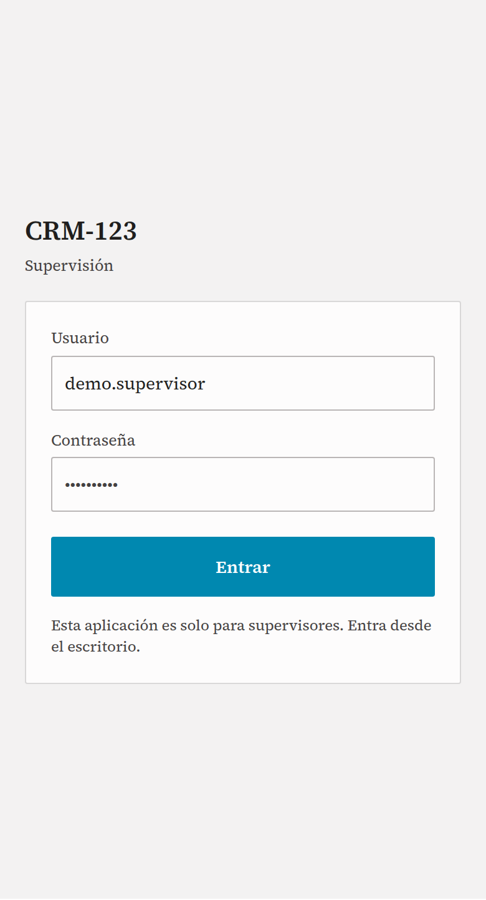

Se entra con el mismo usuario y contraseña que en el ordenador. Si intenta
entrar un vendedor, la aplicación lo rechaza: *«Esta aplicación es solo para
supervisores. Entra desde el escritorio.»*

## 4.2 El panel

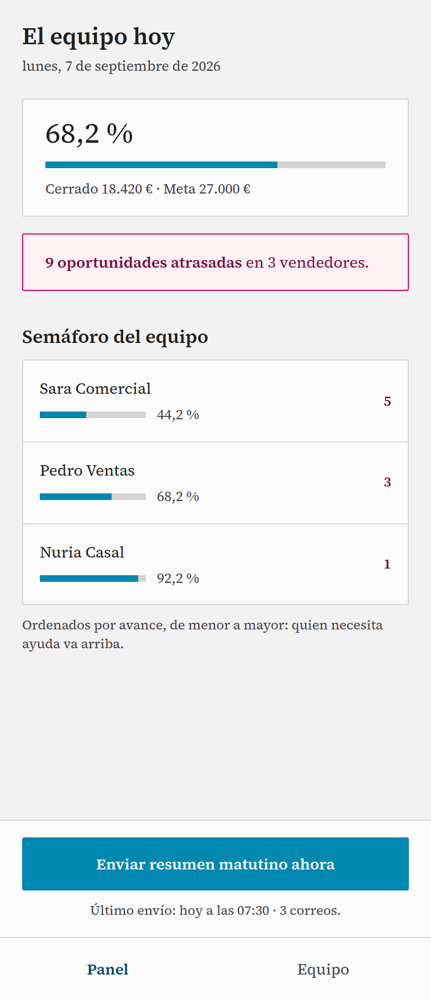

De arriba abajo: el **avance del equipo**, una **alerta de atrasos** que solo
aparece si los hay, y el **semáforo** con una línea por vendedor —barra,
porcentaje y sus atrasadas a la derecha—.

**El semáforo va ordenado de menor a mayor avance.** Arriba, quien necesita
ayuda.

Abajo del todo, fijos: el botón de envío y la línea del **último envío**.

Si aún no has fijado las metas, el panel te lo dice y te manda al ordenador,
porque desde aquí no se pueden fijar.

## 4.3 Ver a un vendedor

Pulsa cualquier línea del semáforo.

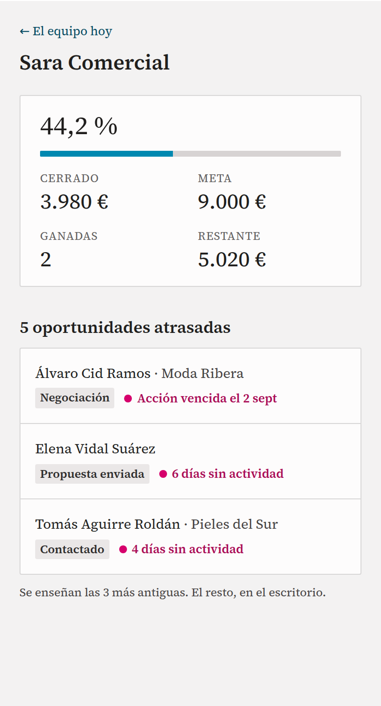

Sus cuatro cifras del mes y sus oportunidades atrasadas, con el motivo de cada
una.

**Es solo para mirar.** No hay ni un botón que cambie nada: se mira desde el
móvil y se actúa desde el ordenador.

## 4.4 Enviar el resumen matutino a mano

El resumen sale solo, de lunes a viernes a las 07:30. Este botón es para
cuando necesitas enviarlo fuera de esa hora: porque el envío automático falló,
porque acabas de cambiar las metas, o porque el equipo vuelve de un puente.

### Paso 1 · Confirmar

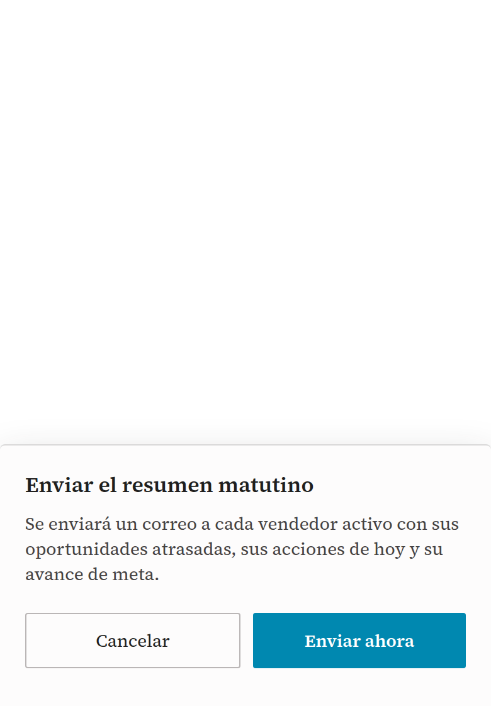

Sube una hoja desde abajo explicando qué va a pasar. Pulsa **Enviar ahora** o
**Cancelar**.

### Paso 2 · Esperar

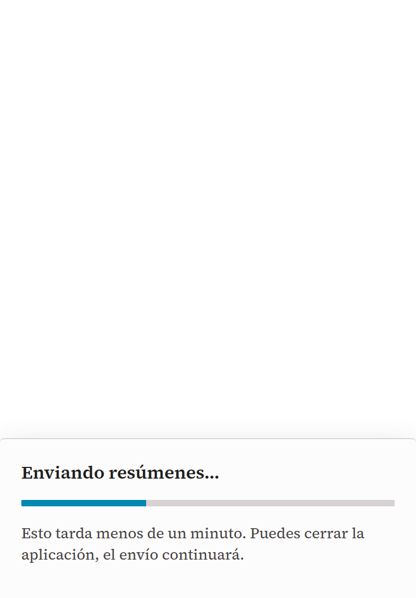

**La hoja no se puede cerrar mientras envía.** No es un fallo: es para que no
te quedes con la duda de si salió o no.

Tarda menos de un minuto. Puedes cerrar la aplicación, el envío sigue.

### Paso 3 · Resultado

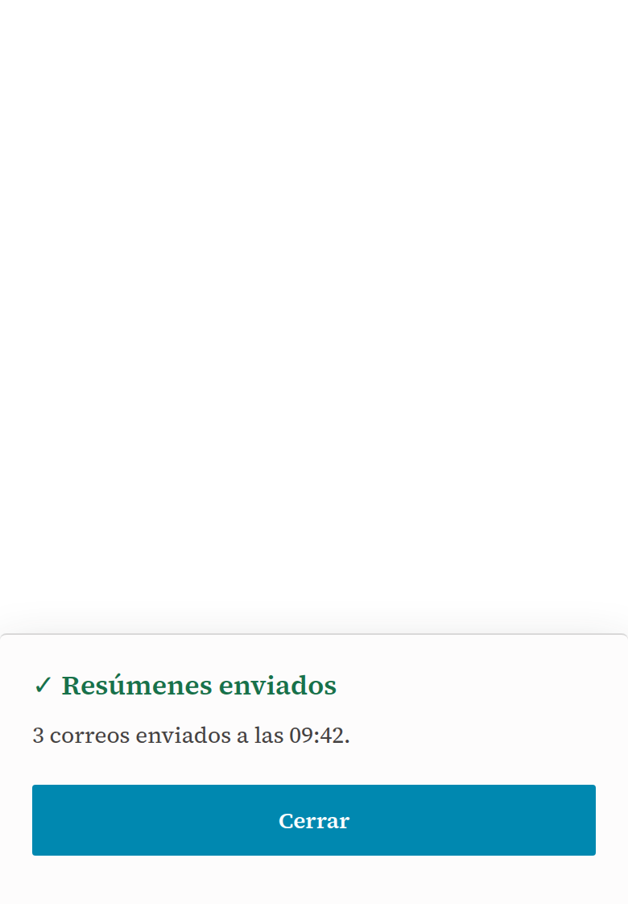

Te dice cuántos correos salieron y a qué hora.

Si algo falla verás *«No se han podido enviar. El envío ha fallado. Vuelve a
intentarlo en unos minutos.»* con un botón de **Reintentar**. Si vuelve a
fallar, el detalle técnico está en la **Auditoría** del ordenador (§3.4).

### Si lo pulsas otra vez enseguida

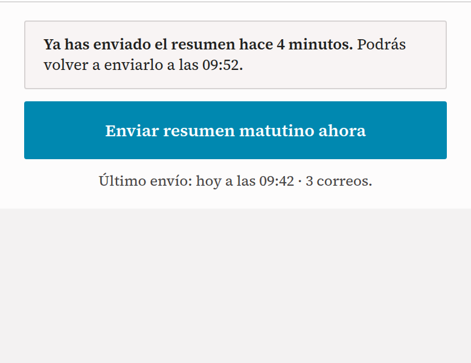

No se abre la hoja. Te dice cuánto hace que se envió y a qué hora podrás
repetirlo.

> **Esto es una protección, no un error.** Existe para que tus vendedores no
> reciban dos correos iguales seguidos por un doble toque, o porque los dos
> supervisores hayáis pulsado a la vez.
>
> El límite son **diez minutos** y cuenta también los envíos automáticos: si el
> de las 07:30 acaba de salir y pulsas a las 07:33, te frenará.

[↑ Volver al contenido](#contenido)

---
---

# Parte 5 · El resumen matutino

## Qué es

Un correo que cada vendedor recibe **de lunes a viernes a las 07:30**, con lo
que tiene que atender ese día. Los fines de semana no se envía.

**Cada uno recibe solo lo suyo.** Ningún correo menciona a otro vendedor.

Los supervisores no lo reciben: para eso tienen el panel.

## Qué trae

Asunto: **CRM-123 · Tu resumen del \<día\>**

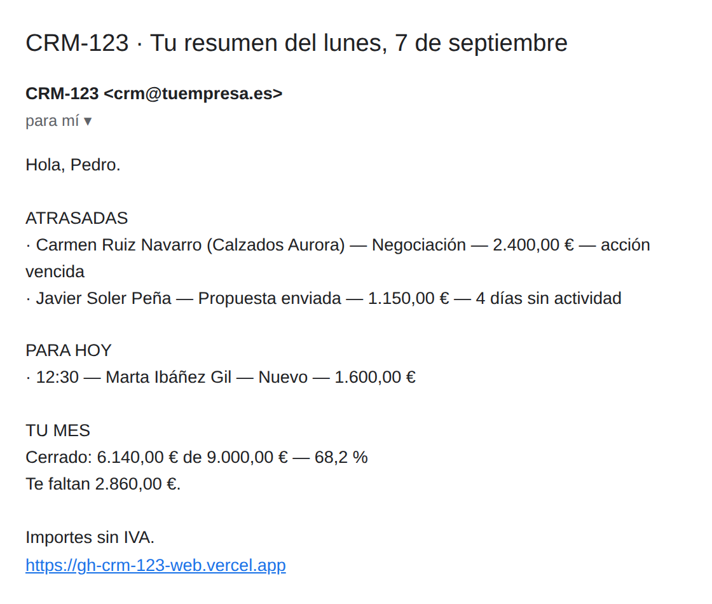

Tres bloques, siempre en el mismo orden:

- **ATRASADAS** — lo que reclama atención, con el motivo de cada una.
- **PARA HOY** — lo que hay agendado para ese día, con su hora.
- **TU MES** — cerrado, meta, porcentaje y cuánto falta.

Es un correo de texto: sin imágenes ni botones. Se lee igual de bien en
cualquier móvil y no acaba recortado.

Cuando un bloque está vacío, lo dice —*«No tienes acciones agendadas para
hoy.»*—. Y si un vendedor no tiene nada atrasado, **recibe el correo igualmente**
con su avance: que no haya nada pendiente también es una noticia que merece
contarse.

Si aún no le han fijado la meta del mes, en lugar del porcentaje lee:
*«Tu supervisor aún no ha fijado tu meta de este mes.»*

> **El remitente depende de vuestro dominio.** Mientras el sistema esté en
> pruebas puede llegar desde una dirección genérica y **acabar en la carpeta de
> spam**. Pide al equipo que lo marque como «No es spam» la primera vez.

## Si un vendedor dice que no le llega

Por este orden:

1. **Que mire la carpeta de spam.** Es la causa en nueve de cada diez casos.
2. Comprueba en **Administración › Usuarios** que su cuenta está activa y su
   correo bien escrito.
3. Mira en **Administración › Auditoría**, en el bloque del resumen matutino,
   si el envío de esa mañana salió y cuántos correos fueron.

[↑ Volver al contenido](#contenido)

---
---

# Anexo A · Mensajes del sistema

| Mensaje | Qué significa | Qué hacer |
|---|---|---|
| *Usuario o contraseña incorrectos.* | Uno de los dos está mal, o la cuenta está desactivada | Revisa el usuario; si sigue, pide que te la restablezcan |
| *Demasiados intentos. Espera unos minutos.* | Varios fallos seguidos | Esperar un momento |
| *Esta aplicación es solo para supervisores…* | Un vendedor en la app del móvil | Entrar desde el ordenador |
| *No tienes permiso para ver esto.* | Una pantalla que no corresponde a tu rol | Volver atrás |
| *No tienes permiso para esta acción.* | Algo reservado al supervisor | Pedírselo a tu supervisor |
| *Algo ha fallado. Vuelve a intentarlo.* | Error inesperado | Reintentar; si insiste, avisar a quien administra |
| *No hemos encontrado lo que buscas.* | La ficha no existe o no es tuya | Volver a la lista |
| *Espera unos minutos antes de reintentar.* | El límite de diez minutos del resumen | Esperar |
| *El historial no se puede modificar.* | Es un recordatorio, no un error | Añadir otra nota si hace falta |
| *Importes sin IVA* | Recordatorio de que las cifras son base imponible | Nada |

---

# Anexo B · Dudas frecuentes

**He cerrado una venta con el importe equivocado.**
No se puede reabrir. Abre una oportunidad nueva para ese cliente con el importe
correcto y explica en una nota qué ha pasado.

**Me dice que el teléfono ya existe, pero no veo a ese cliente.**
Es de un compañero. El sistema no te dice de quién, a propósito. Habla con tu
supervisor.

**Mi avance sale como `—` en vez de un porcentaje.**
Tu supervisor no te ha fijado la meta del mes. No es un error.

**Quiero borrar un cliente.**
No se borra: se archiva. Deja de aparecer y puedes recuperarlo cuando quieras.

**Registré una actividad equivocada.**
No se corrige. Añade otra nota aclarándolo.

**Hablé ayer con el cliente y me sigue saliendo como atrasado.**
Porque hablar no basta: hay que **registrar la actividad**. El sistema solo
sabe lo que le cuentas.

**He pulsado enviar el resumen y no me deja otra vez.**
Han pasado menos de diez minutos desde el último envío, automático o manual.

**Un compañero se va de la empresa. ¿Borro su usuario?**
No: **desactívalo**. Sus clientes y su historial se conservan, y sus cifras
dejan de contar. Después, reasigna sus clientes a quien corresponda.

---

# Anexo C · Glosario

| Palabra | Qué es |
|---|---|
| **Cliente** | Una persona o empresa. Tiene un teléfono único en todo el sistema |
| **Oportunidad** | Una posible venta a ese cliente. Solo una abierta a la vez |
| **Etapa** | En qué punto está: Nuevo, Contactado, Propuesta enviada, Negociación, Cerrado |
| **Actividad** | Cada cosa que registras: llamada, WhatsApp, email, visita o nota |
| **Próxima acción** | La fecha y hora en que has quedado en volver a moverlo |
| **Atrasada** | Sin actividad más días de los que su etapa admite, o con la acción vencida |
| **Meta** o **cuota** | Lo que se espera que cierres este mes. La fija tu supervisor |
| **Avance** | Cuánto llevas de tu meta, en porcentaje |
| **Archivar** | Retirar un cliente sin perder nada. Reversible |
| **Desactivar** | Dejar a un usuario sin acceso sin perder su historial. Reversible |
| **Resumen matutino** | El correo diario de las 07:30 con lo que hay que atender |

[↑ Volver al contenido](#contenido)

---
---

## Sobre este manual

*Escrito a partir del código en producción de CRM-123. Las 22 imágenes son
maquetas hechas con el sistema de diseño de la aplicación, con datos de ejemplo
inventados; se regeneran con `docs/maqueta-capturas/`. Si la interfaz cambia,
hay que revisar este documento y rehacer las imágenes afectadas.*
